# devin-remediation-orchestrator

## 1. Overview

A small FastAPI service that turns one curated GitHub security advisory into
a fully independently-verified remediation, using Devin to do the work and
GitHub Actions — not Devin — to decide whether it succeeded.

### End-to-end architecture

```mermaid
flowchart LR
    ISSUE["Curated GitHub issue<br/><code>devin-remediate</code> label"]
    ORCH["Orchestrator<br/>validate · start · track"]
    DEVIN["Devin session<br/>investigate · implement · test"]
    PR["Draft pull request<br/>human approval remains"]
    CI["GitHub Actions<br/>verify the exact PR commit"]
    DASH["Dashboard<br/>status · outputs · results"]

    ISSUE -->|signed webhook| ORCH
    ORCH -->|Devin API| DEVIN
    DEVIN -->|opens or updates| PR
    PR -->|verify-remediation| CI
    CI -->|result, via webhook to the orchestrator| DASH
    ORCH -.->|first CI failure: repair same session| DEVIN
```



The solid arrows show the normal path from an approved issue to a verified
draft PR, ending at the dashboard. The dotted arrow is the single repair
path: on the first CI failure, the orchestrator sends a message back to the
*same* Devin session rather than starting a new one. The orchestrator
receives every step's webhook and updates the dashboard throughout — that
per-stage handoff is condensed into one line here for readability. Devin
does the adaptable engineering work, GitHub Actions decides whether the
exact commit passed, and a human still decides whether to merge.

Four boundaries keep the loop controlled:

- GitHub issue text is never used as an agent prompt; only trusted advisory
  data is sent to Devin.
- Delivery and issue-level idempotency prevent duplicate sessions.
- Devin finishing is not success; only CI on the recorded PR head SHA can
  mark a session verified.
- Automation gets one repair attempt, then stops for human review.

## 2. Prerequisites

- **Python 3.11+** — to run the service directly.
- **Docker with Compose** — to run it containerized (`docker compose` v2
  syntax, i.e. no separate `docker-compose` binary needed).
- **GitHub CLI (`gh`)** — only needed for local webhook forwarding during a
  live demo (`gh webhook forward`); not required to run the service itself.
- **Real GitHub and Devin API access** — only needed for the live one-issue
  demo (section 7). Everything else (startup, dashboard, the full test
  suite) works with empty credentials.

## 3. Environment variables

All variables live in `.env.example` (safe to commit — no real values) and
are loaded into `.env` (git-ignored) for local use.

**The service itself requires no credentials to start.** `/health`, `/`,
and `/api/metrics` all work with every variable empty. Configuration is
only needed once you exercise a specific capability, layered as follows:

- **Service startup** — no credentials required.
- **Webhook intake** (`POST /webhook/github` accepting a request at all) —
  `WEBHOOK_SECRET`, `GITHUB_REPO`, `APPROVED_ACTORS`.
- **Dispatch** (creating a Devin session from a curated `issues` label
  event) — GitHub and Devin credentials, plus the Playbook ID and ACU
  limit: `GITHUB_TOKEN`, `DEVIN_API_KEY`, `DEVIN_ORG_ID`,
  `DEVIN_PLAYBOOK_ID`, `DEVIN_MAX_ACU_LIMIT`.
- **Polling** (the background task that discovers a session's PR) —
  `DEVIN_API_KEY`, `DEVIN_ORG_ID`, `GITHUB_TOKEN`, `GITHUB_REPO`.
- **Verification / repair** (handling a `workflow_run` event) — the
  verification workflow name plus GitHub/Devin configuration:
  `VERIFY_WORKFLOW_NAME`, `GITHUB_TOKEN`, `DEVIN_API_KEY`, `DEVIN_ORG_ID`,
  `GITHUB_REPO`.

| Variable | Controls | Required for |
|---|---|---|
| `DATABASE_PATH` | Path to the SQLite file | Optional — defaults to `./orchestrator.db` if unset |
| `WEBHOOK_SECRET` | HMAC-SHA256 signature verification on `POST /webhook/github` | Webhook intake — the endpoint returns `503` without it |
| `GITHUB_REPO` | The only repository (`owner/name`) accepted from webhook payloads | Webhook intake, dispatch, polling, verification |
| `APPROVED_ACTORS` | Comma-separated GitHub usernames allowed to trigger remediation via the `issues` event | Webhook intake — the endpoint returns `503` without it |
| `GITHUB_TOKEN` | GitHub API bearer token | Dispatch (adding the `devin-in-progress` label), polling (reading PR head SHA), verification (listing PR files) |
| `DEVIN_API_KEY` | Devin v3 API bearer token | Dispatch (creating a session), polling (reading session status), repair (sending a message) |
| `DEVIN_ORG_ID` | Devin organization ID | Same calls as `DEVIN_API_KEY`, always used together |
| `DEVIN_PLAYBOOK_ID` | Devin remediation Playbook ID attached to each session | Dispatch only |
| `DEVIN_MAX_ACU_LIMIT` | Positive integer ACU budget per session | Dispatch only |
| `VERIFY_WORKFLOW_NAME` | The `workflow_run.name` the verification handler filters on | Verification — a `workflow_run` event with a different name is ignored |
| `VERIFY_CHECK_NAME` | Documents the GitHub check-run name expected on the fork, for setup/manual confirmation | **Not read by the runtime.** Kept for engineers wiring up the fork's Actions workflow to confirm the check-run name matches what a reviewer expects to see in the GitHub UI. |

## 4. Run locally

```bash
python3 -m venv .venv
source .venv/bin/activate
pip install -r requirements.txt
if [ ! -f .env ]; then cp .env.example .env; fi
```

Edit `.env` with real values only if you intend to run the live demo (all
fields can stay empty otherwise). Load it into your shell:

```bash
set -a
source .env
set +a
```

Start the service:

```bash
uvicorn app:app --reload
```

Check it's up:

```bash
curl http://127.0.0.1:8000/health          # {"status":"ok"}
curl http://127.0.0.1:8000/api/metrics     # dashboard data as JSON
open http://127.0.0.1:8000/                # dashboard UI
```

## 5. Run with Docker

```bash
if [ ! -f .env ]; then cp .env.example .env; fi   # edit with real values only for the live demo
docker compose up --build
```

Then:

- Dashboard: [http://localhost:8000/](http://localhost:8000/)
- Health: [http://localhost:8000/health](http://localhost:8000/health)
- Metrics: [http://localhost:8000/api/metrics](http://localhost:8000/api/metrics)

Stop it cleanly:

```bash
docker compose down
```

SQLite is stored in a named Docker volume (`orchestrator-data`, mounted at
`/data` inside the container, with `DATABASE_PATH=/data/orchestrator.db`),
so data persists across `docker compose up`/`down` cycles but lives outside
the image and outside the repository working tree. `ORCHESTRATOR_PORT` and
`ORCHESTRATOR_ENV_FILE` can override the published port and the env file
used, e.g.:

```bash
ORCHESTRATOR_ENV_FILE=.env.example ORCHESTRATOR_PORT=18000 docker compose up --build
```

## 6. Safe simulation

Every webhook path, dispatch, polling transition, verification outcome, and
repair branch is covered by mocked unit tests — no test ever calls GitHub
or Devin. The test suite forces `DATABASE_PATH` to a temporary test
location and never opens or modifies the live `orchestrator.db`.

```bash
python -m unittest -v \
  test_webhook.py \
  test_dispatch.py \
  test_polling.py \
  test_verification.py \
  test_dashboard.py
```

62 tests, all passing, no network access required.

## 7. One-issue live demo

This is the only path that touches real GitHub and Devin infrastructure —
**it creates a real Devin session and consumes account quota.**

Prerequisites: `verify-remediation.yml` and `scripts/assert_remediated.py`
already on the fork's default branch, and issue #1 in
`aman-sharma-nine/superset` exists with an entry in `advisories.json`.

1. Start the service (locally or via Docker) with real credentials loaded.
2. In a separate terminal, load `.env` into **that** shell too, then start
   forwarding for both event types:

   ```bash
   set -a
   source .env
   set +a

   gh webhook forward \
     --repo=aman-sharma-nine/superset \
     --events=issues,workflow_run \
     --url=http://localhost:8000/webhook/github \
     --secret="$WEBHOOK_SECRET"
   ```

   This `source .env` step is required in the forwarding terminal even when
   the service itself is running inside Docker — `gh webhook forward` reads
   `WEBHOOK_SECRET` from its own shell environment, not from the
   container's.

3. Add the label **exactly once**:

   ```bash
   gh issue edit 1 --repo aman-sharma-nine/superset --add-label devin-remediate
   ```

4. Watch [http://localhost:8000/](http://localhost:8000/) — the dashboard
   moves from `Dispatched: 1` → `PRs opened: 1` → `CI verified: 1` as the
   session progresses, with no page reload.

## 8. Security controls

- **HMAC-SHA256 webhook verification** — every request to
  `POST /webhook/github` is checked with `hmac.compare_digest` against
  `WEBHOOK_SECRET` before any payload is parsed.
- **Repository allowlist** — only `GITHUB_REPO` is accepted; every other
  `repository.full_name` is rejected.
- **Actor allowlist** — only senders in `APPROVED_ACTORS` can trigger
  remediation via the `issues` event (`workflow_run` events, raised by
  GitHub Actions rather than a human, skip this check but still require a
  valid signature and the configured repository).
- **Trusted prompt input** — the Devin prompt is built only from
  `advisories.json`; issue title, body, and comments are never read,
  removing a prompt-injection surface.
- **Delivery idempotency** — `deliveries.delivery_id` is UNIQUE, so a
  redelivered webhook is a no-op.
- **Issue-level idempotency** — `sessions.issue_number` is UNIQUE and
  claimed atomically before any external API call, so at most one Devin
  session is ever created per issue.
- **No credential leakage** — handled GitHub and Devin API errors record
  only safe status/type information; authorization headers and response
  bodies are not logged, stored, or returned by `/api/metrics`.
- **Protected verifier files** — on a green check, the PR's changed files
  are checked against `.github/workflows/verify-remediation.yml` and
  `scripts/assert_remediated.py`; a PR that touched either is marked
  `needs_human` instead of `verified`, because a green check on a PR that
  edited its own gate proves nothing.
- **Independent CI verification** — `outcome=verified` is set only by a
  `workflow_run` webhook reporting `conclusion=success`, never by Devin's
  own session status.
- **One repair maximum** — a CI failure triggers exactly one repair message
  to the original session (never a new one); a second failure on the
  repaired commit goes straight to `needs_human` with no retry loop.

## 9. Troubleshooting

| Symptom | Likely cause |
|---|---|
| `POST /webhook/github` returns `503` | Missing `WEBHOOK_SECRET`, `GITHUB_REPO`, or `APPROVED_ACTORS` (or, for the `issues` branch specifically, missing dispatch config: `GITHUB_TOKEN`, `DEVIN_API_KEY`, `DEVIN_ORG_ID`, `DEVIN_PLAYBOOK_ID`, `DEVIN_MAX_ACU_LIMIT`) |
| Devin returns `403` on session create or read | Check remaining account quota, that the service-user/API key has session-create permission (not just view), that `DEVIN_ORG_ID` matches the key's organization, and that the key hasn't been rotated or revoked |
| No webhook deliveries arrive at all | Confirm `gh webhook forward` is actually running (it blocks the terminal — a closed/exited process delivers nothing) and check for a stale hook left over from a previous forwarding session blocking new hook registration (`gh api repos/<repo>/hooks`) |
| Startup logs "polling disabled" | One or more of `DEVIN_API_KEY`, `DEVIN_ORG_ID`, `GITHUB_TOKEN`, `GITHUB_REPO` is empty — the rest of the service still runs normally |
| The same label event appears to do nothing twice | Expected — `claim_session()` is the issue-level idempotency boundary; a duplicate delivery or repeated label toggle for an issue that already has a session is a deliberate no-op, not a bug |
